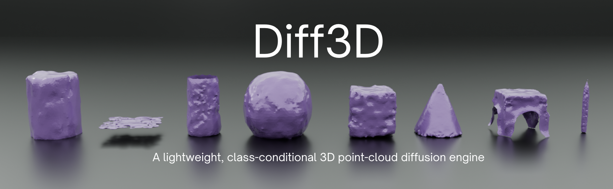
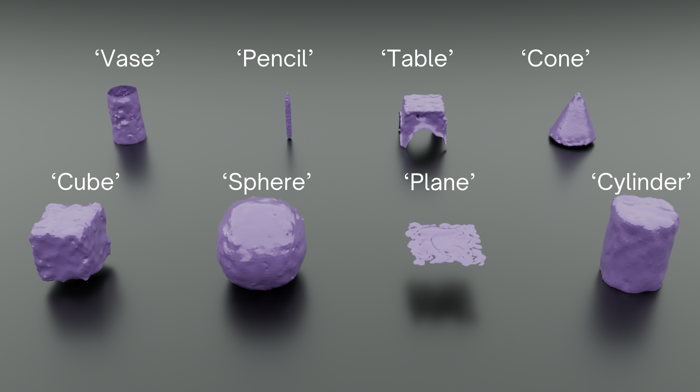
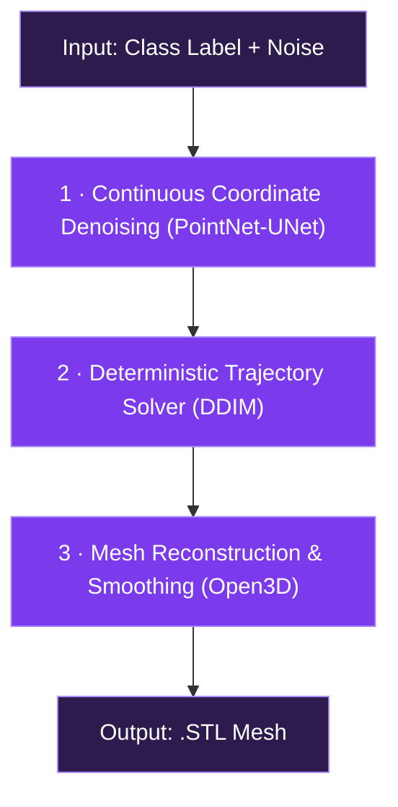

<div align="center">



<br/>

[](LICENSE)
[](https://python.org)
[](https://pytorch.org)
[](http://www.open3d.org/)

</div>

---

## Overview

Diff3D is an autonomous generative 3D modelling system which, unlike computationally heavy rendering heuristics or Neural Radiance Fields (NeRFs), seeks to diffuse directly over point clouds across 3D coordinates.

The pipeline incorporates a PointNet-UNet and DDIM solver, which have been trained natively within 3-dimensional data. Following which, Poisson Surface Reconstruction is used to produce export-ready `.stl` files. While the model is highly primitive in nature, it enables the generation of diffusion-based 3D models within seconds on consumer hardware.

## Supported Archetypes

The model is conditioned to generate 8 distinct geometric archetypes via embedded class conditioning:

<div align="center">

</div>

| Prompt Index | Prompt Keyword |
| :---: | :---: |
| `0` | **`cone`** |
| `1` | **`cube`** |
| `2` | **`cylinder`** |
| `3` | **`pencil`** |
| `4` | **`plane`** |
| `5` | **`sphere`** |
| `6` | **`table`** |
| `7` | **`vase`** |

## Architectural Pipeline

The generation process converts Gaussian noise into a smoothed, watertight mesh through three stages:



Further implementation details:

1. **Continuous Coordinate Denoising (PointNet-UNet):** To begin, a PointNet-based U-Net predicts the noise at each timestep, incorporating 1D convolutions. The model receives a sinusoidal timestep embedding, alongside a learned class embedding.
2. **Deterministic Trajectory Solver (DDIM):** Once the model is able to predict noise, a DDIM solver moves from pure noise to a point cloud in 30–50 steps.
3. **Mesh Reconstruction & Smoothing (Open3D):** The raw point cloud is cleaned up by removing statistical outliers, then its surface normals are oriented consistently outward from the shape’s center. Screened Poisson reconstruction turns the points into a watertight mesh, before finally Taubin smoothing is used to soften rough edges without shrinking the overall volume.

## Empirical Benchmarks & Hardware Profiling

### Model Convergence

The PointNet-UNet noise predictor was evaluated against an unseen holdout test split using the MSE loss:

$$\mathcal{L}_{\text{MSE}} = \frac{1}{B \cdot N \cdot 3} \sum \Vert{}\epsilon - \epsilon_\theta(x_t, t, c)\Vert{}^2$$

- **Final Evaluation Loss:** 0.036 (demonstrating clean convergence without catastrophic class collapse).

## User Guide

### Installation

```bash
# Clone the repository
git clone https://github.com/shauryanagar/Diff3D.git
cd Diff3D

# Set up virtual environment
python3 -m venv venv
source venv/bin/activate  # On Windows: venv\Scripts\activate

# Install dependencies
pip install --upgrade pip
pip install -r requirements.txt
```

### Headless CLI-based generation

```bash
# Generate a cube using 40 DDIM steps
python generate.py --prompt cube --steps 40 --out cube.stl

```

### Interactive Gradio Interface

```bash
python app.py
```

Navigate to `http://127.0.0.1:7860` in a web browser.
